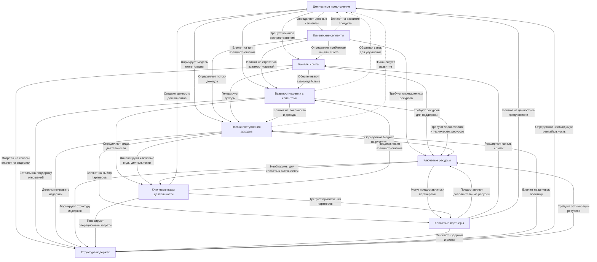
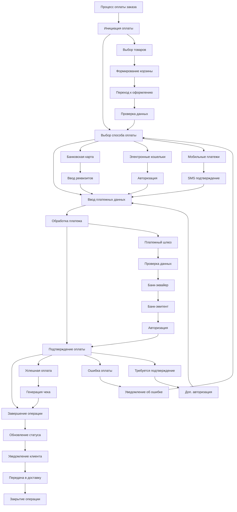

# TF-IDF Analyzer Web Application

## Описание

Это веб-приложение на Flask для анализа текстовых файлов. Оно вычисляет и отображает:

- 50 самых частых слов из загруженного текста
- TF (Term Frequency) - частоту встречаемости слова в документе
- IDF (Inverse Document Frequency) - обратную частоту документа

Приложение имеет простой и интуитивно понятный интерфейс для загрузки файлов и просмотра результатов анализа.

## Основные функции

1. Загрузка текстовых файлов (.txt) через веб-интерфейс
2. Автоматическая обработка текста (удаление пунктуации, приведение к нижнему регистру)
3. Расчет статистических показателей TF и IDF
4. Отображение результатов в виде сортированной таблицы
5. Возможность вернуться к форме загрузки нового файла

## Скриншоты интерфейса

### Страница загрузки файла

[Здесь будет скриншот главной страницы с формой загрузки]

### Страница с результатами анализа

[Здесь будет скриншот таблицы с результатами TF-IDF]

## Как использовать

1. Перейдите на главную страницу приложения
2. Нажмите "Выберите файл" и укажите текстовый файл для анализа
3. Нажмите кнопку "Анализировать"
4. Просмотрите результаты в виде таблицы
5. Для нового анализа нажмите "Назад к форме загрузки"

## Технические детали

Приложение обрабатывает текст следующим образом:
- Удаляет всю пунктуацию
- Приводит слова к нижнему регистру
- Игнорирует стоп-слова (если реализовано)
- Считает частоту каждого слова
- Сортирует слова по частоте встречаемости
- Вычисляет TF и IDF для каждого слова

👨‍💻 Разработано для тестового задания по python+flask(fastapi,django). 🚀
---

⚡ **Автор:** *[nonlise]*  
📅 **Дата создания:** *[31.03.2025]*  

# Интеллект-карта: Бизнес-модель приложения

## Центральный узел: Бизнес-модель приложения

### 1. Ценностное предложение
**Ключевые элементы:**
- Уникальные функции приложения
- Решаемые проблемы пользователей
- Преимущества перед конкурентами
- Целевая аудитория

**Подкатегории:**
- **Основные ценности**
  - Удобство использования
  - Экономия времени
  - Снижение затрат
  - Повышение эффективности

- **Уникальное торговое предложение**
  - Ключевые особенности
  - Технологические преимущества
  - Патентованные решения

### 2. Клиентские сегменты
**Основные группы:**
- Массовый рынок
- Нишевые рынки
- Многосторонние платформы

**Характеристики:**
- **Демография**
  - Возрастные группы
  - Географическое положение
  - Уровень дохода
  - Образование

- **Поведенческие паттерны**
  - Частота использования
  - Лояльность бренду
  - Готовность платить

### 3. Каналы сбыта
**Типы каналов:**
- Прямые продажи
- Партнерские сети
- Онлайн-платформы

**Этапы:**
- **Привлечение**
  - Маркетинговые кампании
  - SEO/SMM
  - Партнерские программы

- **Удержание**
  - Email-рассылки
  - Push-уведомления
  - Программы лояльности

### 4. Взаимоотношения с клиентами
**Стратегии:**
- Персональная поддержка
- Самообслуживание
- Автоматизированное обслуживание

**Метрики:**
- **Удовлетворенность**
  - NPS (Индекс лояльности)
  - CSI (Индекс удовлетворенности)
  - Отзывы и рейтинги

- **Удержание**
  - Churn rate (Отток)
  - LTV (Время жизни клиента)
  - Retention rate

### 5. Потоки поступления доходов
**Типы монетизации:**
- Продажа продукта
- Подписка (SaaS)
- Комиссионные сборы
- Реклама

**Структура:**
- **Источники дохода**
  - Разовые платежи
  - Регулярные платежи
  - Комиссии за транзакции
  - Лицензирование

- **Ценообразование**
  - Фиксированная цена
  - Динамическое ценообразование
  - Freemium модель

### 6. Ключевые ресурсы
**Категории ресурсов:**
- Физические активы
- Интеллектуальная собственность
- Человеческие ресурсы
- Финансовые ресурсы

**Конкретные активы:**
- **Технологические**
  - Серверная инфраструктура
  - Программное обеспечение
  - Базы данных

- **Бизнес-активы**
  - Бренд и репутация
  - Патенты и лицензии
  - Бизнес-процессы

### 7. Ключевые виды деятельности
**Основные операции:**
- Разработка продукта
- Маркетинг и продажи
- Поддержка клиентов

**Бизнес-процессы:**
- **Производственные**
  - Разработка новых функций
  - Тестирование качества
  - Обновления и патчи

- **Операционные**
  - Обслуживание инфраструктуры
  - Мониторинг производительности
  - Обработка данных

### 8. Ключевые партнеры
**Типы партнерств:**
- Стратегические альянсы
- Поставщики технологий
- Маркетинговые партнеры

**Области сотрудничества:**
- **Технологические партнеры**
  - Cloud-провайдеры
  - Платежные системы
  - API-интеграции

- **Бизнес-партнеры**
  - Дистрибьюторы
  - Аффилиаты
  - Контент-провайдеры

### 9. Структура издержек
**Типы затрат:**
- Постоянные издержки
- Переменные издержки
- Капитальные затраты

**Основные статьи:**
- **Операционные расходы**
  - Зарплаты сотрудников
  - Аренда серверов
  - Маркетинговые бюджеты

- **Разовые затраты**
  - Разработка MVP
  - Приобретение лицензий
  - Юридическое оформление

## Детальная визуализация связей:

# Mind Map: Процесс оплаты заказа

## Центральный узел: Процесс оплаты заказа

### 1. Инициация оплаты
**Действия:**
- Выбор товаров
- Формирование корзины
- Переход к оформлению

**Данные:**
- Состав заказа
- Итоговая сумма
- Данные доставки

### 2. Выбор способа оплаты
**Варианты:**
- Банковская карта
- Электронные кошельки
- Мобильные платежи
- Наложенный платеж

**Параметры:**
- Доступные методы
- Комиссии
- Сроки зачисления

### 3. Ввод платежных данных
**Типы данных:**
- Реквизиты карты
- Данные электронного кошелька
- SMS подтверждения

**Безопасность:**
- Шифрование данных
- 3D Secure
- Антифрод система

### 4. Обработка платежа
**Участники:**
- Платежный шлюз
- Банк-эквайер
- Банк-эмитент

**Процессы:**
- Авторизация
- Проверка лимитов
- Блокировка средств

### 5. Подтверждение оплаты
**Результаты:**
- Успешная оплата
- Ошибка оплаты
- Требуется доп. подтверждение

**Уведомления:**
- Покупателю
- Магазину
- В систему учета

### 6. Завершение операции
**Действия:**
- Формирование чека
- Обновление статуса заказа
- Начало обработки заказа

**Документы:**
- Электронный чек
- Квитанция об оплате
- Накладная

## Детальная визуализация процесса:

